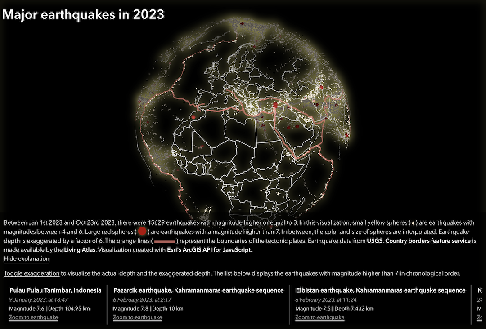

# Earthquakes visualization

This application has been forked from a repository of [RalucaNicola](https://github.com/RalucaNicola/earthquakes-viz) and shows the earthquakes in 2023 with an exaggerated depth. The earthquake data used in this app comes from [USGS](https://earthquake.usgs.gov/earthquakes/search/). The app is created with [Esri's ArcGIS API for JavaScript](https://developers.arcgis.com/javascript).

[](https://enricator.github.io/earthquakes-viz/)

## How to re-create this visualization with your own data

If you want to visualize your own data like this, follow the steps below:

1. Fork this repository (or RalucaNicola's).
2. Clone it locally on your machine:
   `git clone https://github.com/your_user_name/earthquakes-viz.git`
3. Download data from USGS:
   - Go to this site: https://earthquake.usgs.gov/earthquakes/search/
   - Set the filters that you need (time, location, magnitude, etc.)
   - Make sure that the download format is `csv`.
4. Rename the file to `earthquake_data.csv` and replace the csv file in this folder.
5. Replace `2019` in the title of the app and the description with your chosen
   period of time. Or replace it with anything else you want.
6. Commit your changes and push them on Github.

```
git add .
git commit -m "Change dataset"
git push origin master
```

7. In the Settings tab of your repo, choose master as the branch where your website will be served from.

You should now have a live website running with this visualization with your own data.

## License

This project is released under an MIT license.
